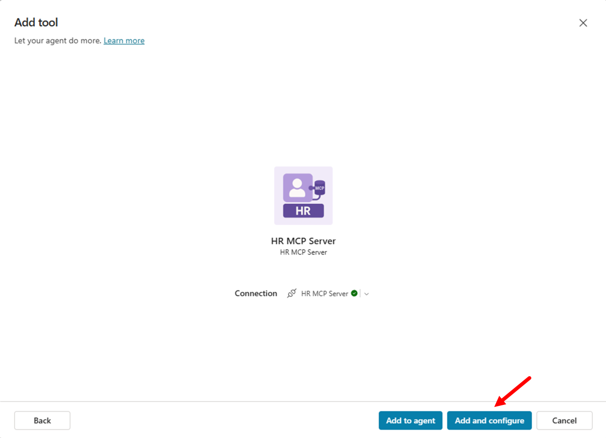
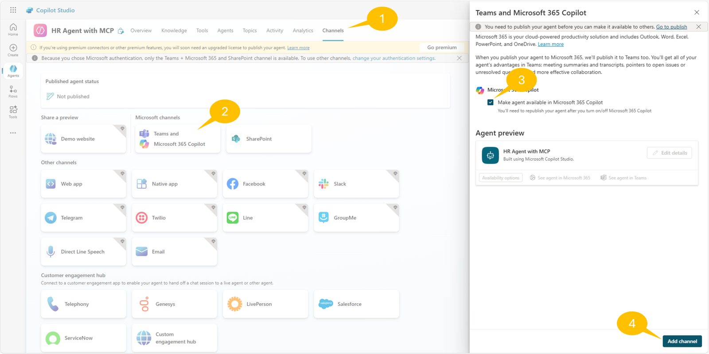

# Microsoft Copilot Studio
## Lab 03 - Consuming an Custom MCP Server

In this lab, you are going to understand how to extend an agent made with Microsoft Copilot Studio using an MCP (Model Context Protocol) server. Specifically, you are going to consume an existing HR MCP server that provides tools for managing a hypothetical list of candidates for a job role. The MCP server will offer functionalities to:

- List all candidates
- Search for candidates by criteria
- Add new candidates
- Update existing candidate information
- Remove candidates

### In this lab you will learn:

- How to configure and connect to an existing MCP server
- How to consume MCP tools and resources from an external server
- How to integrate MCP servers with Copilot Studio agents

*** 
If you don't want to set up your own MCP server, you can use the provided mock server for testing purposes. and go to Step 2. <br/>
https://hr-mcp-ci.ambitiousbush-7fa2fef0.eastasia.azurecontainerapps.io/mcp

*** 

### [Optional] Step 1 : Deploy the MCP Server to Azure Container App
The HR MCP server that you will be consuming in this lab provides the following tools:

- list_candidates: Provides the whole list of candidates
- search_candidates: Searches for candidates by name, email, skills, or current role
- add_candidate: Adds a new candidate to the list
- update_candidate: Updates an existing candidate by email
- remove_candidate: Removes a candidate by email

The server manages candidates information including:

Personal details (firstname, lastname, full name, email)
Professional information (spoken languages, skills, current role)


0. Prerequisites
- Azure subscription
- [Azure CLI](https://learn.microsoft.com/en-us/cli/azure/install-azure-cli?view=azure-cli-latest)
- [Azure Developer CLI (azd)](https://learn.microsoft.com/en-us/azure/developer/azure-developer-cli/install-azd?tabs=winget-windows%2Cbrew-mac%2Cscript-linux&pivots=os-windows)
- [Docker](https://docs.docker.com/get-docker/)
- [Git](https://git-scm.com/downloads)

1. Clone the git repository:
```bash
#git clone https://github.com/radezheng/hr-mcp-ci
git clone https://gitee.com/radez/hr-mcp-ci
cd hr-mcp-ci
```

2. Login to Azure:
```bash
az login
```

3. Run `azd up` in the project directory:
```bash
azd up  
```
input the environment name (any string) and other parameters as prompted. wait for the deployment to complete. the MCP Server url will be displayed in the output.


4. (Optional) Test the MCP Server use the mcp inspector.

[install npx](https://nodejs.org/en/download/)

```
npx @modelcontextprotocol/inspector
```


Fill in the URL displayed in the MCP Server deployment output or the testing URL above, end with "/mcp".

### Step 2: Creating a New Agent in Copilot Studio
In this step you are going to create a new agent in Microsoft Copilot Studio that will consume the MCP server you configured in Step 1.


1. Creating the new agent
Open a browser and, using the work account of your target Microsoft 365 tenant, go to https://copilotstudio.microsoft.com to start using Microsoft Copilot Studio.

select Create in the left navigation menu, then choose Agent to create a new agent.

Choose to Skip to configure and define your new agent with the following settings:

- ***Name***:
```text
HR Agent with MCP
```

- ***Description***:
```text
You are a helpful HR assistant that specializes in candidate management. You can help users search
for candidates, check their availability, get detailed candidate information, and add new
candidates to the system.
Always provide clear and helpful information about candidates, including their skills, experience,
contact details, and availability status.
```


Select ***Create*** to create your new agent.

2. Configuring the agent's conversation starters
After creating the agent, you'll be taken to the agent configuration page. In the ***Suggested prompts*** section, add these helpful prompts:

- ***Title***: `List all candidates` - ***Prompt***: `List all the candidates`
- ***Title***: `Search candidates` - ***Prompt***: `Search for candidates with name [NAME_TO_SEARCH]`
- ***Title***: `Add new candidate` - ***Prompt***: `Add a candidate with firstname [FIRSTNAME], lastname [LASTNAME], e-mail [EMAIL], role [ROLE], spoken languages [LANGUAGES], and skills [SKILLS]`

Select the ***Save*** button to confirm your changes.

### Step 3: Adding tools exposed by the MCP Server
In your agent, navigate to the 1️⃣ **Tools** section and select 2️⃣ ***+ Add a tool***.


Choose 1️⃣ ***Model Context Protocol*** group to see all the already existing MCP servers available to you agent. Now select 2️⃣ ***+ New tool*** to add the actual HR MCP server.


A new dialog shows up allowing you to select the kind of tool that you want to add. At the time of this writing, if you select the ***Model Context Protocol*** option, you will be brought to the official Microsoft Copilot Studio documentation page [Extend your agent with Model Context Protocol](https://learn.microsoft.com/en-us/microsoft-copilot-studio/agent-extend-action-mcp) that explains you how to add a new MCP server as a Power Platform custom connector.

In this lab we are going to create the actual custom connector for the MCP server. So, select ***Custom connector*** and proceed with the following steps.


A new browser tab will open, providing you access to the Power Apps configuration page to manage custom connectors. Select 1️⃣ ***+ New custom connector*** and then 2️⃣ ***Import an OpenAPI file***.

Keep this process on hold, Edit [mcp-connector.yaml](./mcp-connector.yaml) if you use your own MCP Server, replace the host `hr-mcp-ci.ambitiousbush-7fa2fef0.eastasia.azurecontainerapps.io` with your own host.
```yaml
swagger: '2.0'
info:
  title: HR MCP Server
  description: >-
    Allows to manage candidates for specific job roles providing tools to list,
    search, add, update, and remove candidates from a reference list
  version: 1.0.0
host: hr-mcp-ci.ambitiousbush-7fa2fef0.eastasia.azurecontainerapps.io
basePath: /
schemes:
  - https
paths:
  /mcp:
    post:
      summary: HR MCP Server
      x-ms-agentic-protocol: mcp-streamable-1.0
      operationId: InvokeMCP
      responses:
        '200':
          description: Success
securityDefinitions: {}
security: []
```
Provide a name for the connector, for example HR MCP Server. Select ***Import*** and browse for the OpenAPI file that you just created. Once you have selected the file, click on ***Continue***


In the page to configure the connector, select to enable the ***Swagger editor*** to switch to the source code of the OpenAPI specification. You can see the content of the YAML file that you just uploaded and you can validate that the specification file is correct.


Select the ***Create connector*** command and wait for the connector to be ready. If you like, you can also provide a custom icon for the connector, to easily recognize it in the list of tools. If you like, you can download the [following icon](https://raw.githubusercontent.com/microsoft/copilot-camp/refs/heads/main/src/make/copilot-studio/path-m-lab-mcs6-mcp/hr-mcp-server-icon.png), use it for the custom connector, and select ***Update connector*** to persist the change.

Now go back to Copilot Studio, select the ***Refresh*** button and go back to the list of available tools.


Now, in the ***Model Context Protocol*** list, you should be able to find the HR MCP Server.


Select the HR MCP Server connector, connect to the server using the default connection user experience of Copilot Studio, and when the connector is connected select ***Add and configure***


All the tools exposed by the MCP server are now available to your agent, as you can verify in the window displaying the MCP server details and tools.


### Step 4: Use the HR MCP Server in Your Agent
1. Test the MCP tools before publish the agent. You can do this by using the built-in testing capabilities of Copilot Studio to invoke the MCP tools and verify their behavior. 


Once the connection is established, you can get the actual list of candidates from the HR MCP server.


For the first time, In order to being able to consume the list of candidates you will need to connect to the target connector. As such, Copilot Studio will ask you to ***Open connection manager***, connect to the MCP server, and then Retry the request.


2. If all are successful, then you can publish the Agent, You can also make the agent available in the Microsoft 365 Copilot Chat. Select the 1️⃣ ***Channels*** section, then select the 2️⃣ ***Teams and Microsoft 365 Copilot*** channel, check the 3️⃣ ***Make agent available in Microsoft 365 Copilot*** option, and then select the 4️⃣ **Add channel** command. Wait for the channel to be enabled, then close the channel side panel and publish the agent again selecting the **Publish** command of the agent in the top right corner.



3. You can also have fun with other prompts like:

```
Update the candidate with email bob.brown@example.com to speak also French
```
or:

```
Add skill "Project Management" to candidate bob.brown@example.com
```
or:

```
Remove candidate bob.brown@example.com
```
The agent will invoke the right tools for you and will act accordingly to your prompts.

Well done! Your agent is fully functional and capable of consuming all the tools exposed by the HR MCP server.

## CONGRATULATIONS!

You have completed Lab  - Consuming an MCP server!

